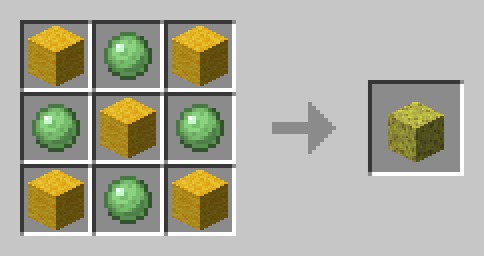
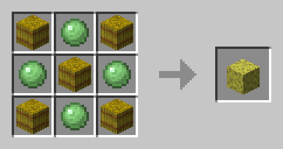

# MCLazyDatapack

> Cubik 自制 Minecraft 懒人合成数据包

------

~~**NOT VANILLA !!!**~~

功能列表：

- [X] 2线合成为1白地毯
- [X] 1白地毯分解成2线
- [X] 1白羊毛分解成4线（原版提供4线合成1羊毛）
- [X] 2地毯合成为1羊毛（颜色不变）
- [X] 使用以下两种方法合成海绵

    
    

## Credit

`wool_from_carpet` recipes are modified from [CodeMouse92/no-monster-minecraft](https://github.com/CodeMouse92/no-monster-minecraft/tree/main/data/minecraft/recipes/wool_from_carpet) under `BSD-3-Clause License`
